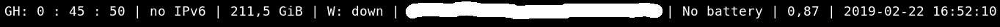

# I3-Github-Notifications

This script expands the i3status bar and shows you how many notifications you have on github.
The notifications are read every 60 second by a python script and written to a file `.ghnotes`.

## Setup

1. Generate a new API Token for the Github API
You can generate them here: [GitHub API Tokens](https://github.com/settings/tokens). and replace the "XXXX" string in `i3-github-status.py`

2. Replace the status_command call in your i3 config with this
```
# ~/.config/i3/config
bar {
        status_command ~/i3-github-status/i3status.sh
}
```

3. Restart i3 (default: $mod + shift + r)

## Alternative

Alternatively you can execute the python script `i3-github-status.py` every time you reload your i3. simply add

```
# ~/.config/i3/config
exec --no-startup-id python ~/i3-github-status/i3-github-status.py
```
to your i3 config

## Format

The output is in the format "GH: X : Y : Z" where X is the amount of issues your participating, Y is the amount of unread notifications and Z is the amount of total notification. 

Currently X, Y and Z cap at 50 notifications since that is the limit for one page. 

## Screenshot

